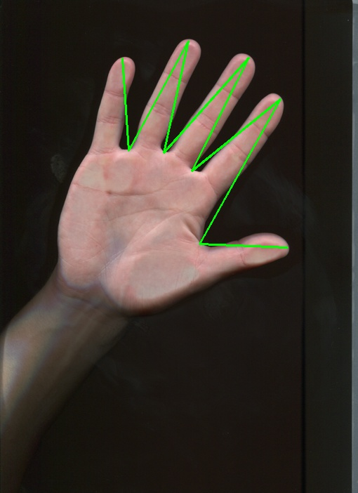

# Лабораторная работа № 2
## Задание
Разработать и реализовать программу для классификации изображений ладоней,
обеспечивающую:
- Ввод и отображение на экране изображений в формате TIF;
- Сегментацию изображений на основе точечных и пространственных
преобразований;
- Генерацию признаковых описаний формы ладоней на изображениях;
- Вычисление меры сходства ладоней;
- Кластеризацию изображений.

В качестве исходных данных прилагается набор из 99 цветных изображений ладоней
разных людей, полученных с помощью сканера, в формате 489×684 с разрешением 72 dpi.
Задача состоит в построении меры сходства изображений на основе выделения и анализа
формы ладоней. Нужно разработать и реализовать алгоритм, входом которого является
изображение, а выходом – описание признаков формы, попарные расстояния, кластеры
изображений.

Примеры входных изображений представлены на [рисунках](./training/).

В качестве признакового описания формы предлагается построить «линию пальцев» -
ломаную линию, соединяющую точки на кончиках пальцев (tips) с точками в основаниях
пальцев (valleys). Пример такой линии представлен на рисунке.
 

## Результаты работы алгоритма
- [Применениt фильтра для поиска границ ладони](./Edges/)
- [Все найденные контуры после применения фильтра](./Contours_all/)
- [Контуры ладони](./Contours_main/)
- [Линии между tips и valleys](./Result_lines/)
- [Кластеризация рук в формате (изображение, номер кластера)](./Clustering/)

